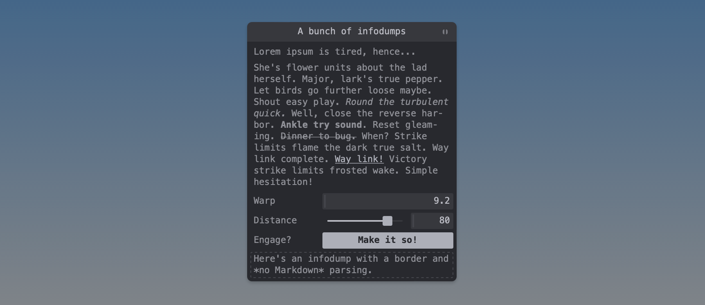

# tweakpane-plugin-infodump

This is an *infodump* plugin for [Tweakpane](https://cocopon.github.io/tweakpane/). Provides a *blade* that displays text, optionally with a border and/or basic Markdown support. Intended for long descriptions (*i.e.*, infodumps!) that wouldn't neatly fit into labels.


<sup>That text is, as you might have guessed based on the controls below, a [Star Trek reference](https://www.youtube.com/watch?v=XU-8Mh2iHEk).</sup>

This implementation is heavily based on the [placeholder blade from the Tweakpane docs](https://github.com/cocopon/tweakpane/blob/a4786be6dae7cad58dbbfe2f047ca097954c4f1f/packages/tweakpane/src/doc/ts/placeholder-plugin.ts) as mentioned in [this issue](https://github.com/cocopon/tweakpane/issues/397).

**Note:** Version [v0.3.0](https://github.com/doersino/tweakpane-plugin-infodump/releases/tag/v0.3.0) and prior are compatible with Tweakpane 3.x. Newer versions match Tweakpane major versions (*e.g.*, [v4.0.0](https://github.com/doersino/tweakpane-plugin-infodump/releases/tag/v4.0.0) is [compatible with](https://github.com/cocopon/tweakpane/issues/396#issuecomment-1418929095) Tweakpane 4.0.0 and subsequent minor releases) but minor/patch versions may differ (due to bug fixes and improvements both here and there).

## Installation

### Browser

Download the most recent release from [here](https://github.com/doersino/tweakpane-plugin-infodump/releases).

```html
<script type="module">
  import {Pane} from 'tweakpane.js';
  import * as InfodumpPlugin from 'tweakpane-plugin-infodump.js';

  const pane = new Pane();
  pane.registerPlugin(InfodumpPlugin);
</script>
```

You can also dynamically load the latest...

```js
import * as InfodumpPlugin from 'https://unpkg.com/tweakpane-plugin-infodump';
```

...or a fixed...

```js
import * as InfodumpPlugin from 'https://unpkg.com/tweakpane-plugin-infodump@4.0.1/dist/tweakpane-plugin-infodump.js';
```

...version via [UNPKG](https://unpkg.com) if you're just quickly testing something (personally, I don't trust services like that for permanent, let alone production, use).


### Package

You can install with `npm`:

```
npm install tweakpane-plugin-file-import
```

And import it like so.

```js
import {Pane} from 'tweakpane';
import * as InfodumpPlugin from 'tweakpane-plugin-infodump';

const pane = new Pane();
pane.registerPlugin(InfodumpPlugin);
```


## Usage

```js
pane.addBlade({
  view: "infodump",
  content: "Major, lark's true pepper. Let birds go further loose maybe. Shout easy play.",
  markdown: false,
});
```

The `markdown` switch is `false` by default, so you wouldn't need to specify it in this example.

Markdown compilation is provided by the [slimdown-js](https://github.com/erikvullings/slimdown-js) package – a very lightweight and hence not entirely-spec-compliant Markdown parser which may or may not lead to issues when going beyond basic text formatting (for this reason, I haven't included CSS rules covering every possible Markdown construct – [file an issue](https://github.com/doersino/tweakpane-plugin-infodump/issues) if you'd like improvements here.)

I recommend using [backtick-delimited strings](https://developer.mozilla.org/en-US/docs/Web/JavaScript/Reference/Template_literals) (where line breaks are allowed) for multiline Markdown, although you'll need to backslash-escape Markdown's code delimiters if you do so.


## Development

### Quick start

Clone this repository, then:

* Install dependencies:

  ```
  $ npm install
  ```

* Build source codes and watch changes:

  ```
  $ npm start
  ```

* Alternatively, open `test/browser.html` to see the result (due to restrictions regarding JavaScript modules when serving directly from the file system, you might need to run `http-server` in the root directory of your clone, then go to `http://localhost:8080/test/browser.html`).

* Cutting a release:

  ```
  $ npm run assets
  ```

  Then `git push` the current state of the code, upload the resulting ZIP file to GitHub (create a release with tag etc., name like "v4.0.0"), and don't forget to run `npm publish`.


### File structure

```
|- src
|  |- sass ............ Plugin CSS
|  |- index.ts ........ Entrypoint
|  |- plugin.ts ....... Plugin
|  |- controller.ts ... Controller for the custom view
|  `- view.ts ......... Custom view
|- dist ............... Compiled files
`- test
   `- browser.html .... Plugin lab
```
