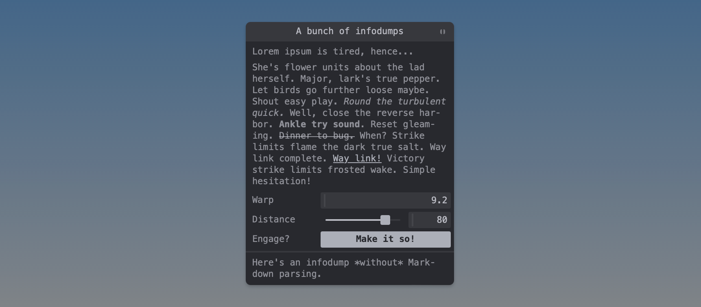

# tweakpane-plugin-infodump

Infodump plugin for Tweakpane. Provides a blade that displays text, optionally with a border and basic Markdown support. Intended for long descriptions (*i.e.*, infodumps) that wouldn't fit into labels.


<sup>That text is, as you might have guessed based on the controls below, a [Star Trek reference](https://www.youtube.com/watch?v=XU-8Mh2iHEk).</sup>

This implementation is heavily based on the [placeholder blade from the Tweakpane docs](https://github.com/cocopon/tweakpane/blob/a4786be6dae7cad58dbbfe2f047ca097954c4f1f/packages/tweakpane/src/doc/ts/placeholder-plugin.ts) as mentioned in [this issue](https://github.com/cocopon/tweakpane/issues/397).

## Installation

### Browser

```html
<script src="tweakpane.min.js"></script>
<script src="tweakpane-plugin-infodump.min.js"></script>
<script>
  const pane = new Tweakpane.Pane();
  pane.registerPlugin(TweakpaneInfodumpPlugin);
</script>
```


### Package

```js
import {Pane} from 'tweakpane';
import * as InfodumpPlugin from 'tweakpane-plugin-infodump';

const pane = new Pane();
pane.registerPlugin(InfodumpPlugin);
```


## Usage

```js
pane.addBlade({
  view: "infodump",
  content: "Major, lark's true pepper. Let birds go further loose maybe. Shout easy play.",
  border: false,
  markdown: false,
});
```

Both the `border` and `markdown` switches are `false` by default, so you wouldn't need to specify them in this example.

Markdown compilation is provided by the [slimdown-js](https://github.com/erikvullings/slimdown-js) package – a very lightweight and hence not entirely-spec-compliant Markdown parser which may or may not lead to issues when going beyond basic text formatting (for this reason, I haven't included CSS rules covering every possible Markdown construct – [file an issue](https://github.com/doersino/tweakpane-plugin-infodump/issues) if you'd like improvements here.)

I recommend using [backtick-delimited strings](https://developer.mozilla.org/en-US/docs/Web/JavaScript/Reference/Template_literals) (where line breaks are allowed) for multiline Markdown, although you'll need to backslash-escape Markdown's code delimiters if you do so.


## Development


### Quick start

Clone this repository, then:

* Install dependencies:

  ```
  $ npm install
  ```

* Build source codes and watch changes:

  ```
  $ npm start
  ```

* Open `test/browser.html` to see the result.

* Cutting a release:

  ```
  $ npm run assets
  ```

  Then upload the resulting ZIP file to GitHub.


### File structure

```
|- src
|  |- sass ............ Plugin CSS
|  |- index.ts ........ Entrypoint
|  |- plugin.ts ....... Plugin
|  |- controller.ts ... Controller for the custom view
|  `- view.ts ......... Custom view
|- dist ............... Compiled files
`- test
   `- browser.html .... Plugin lab
```


